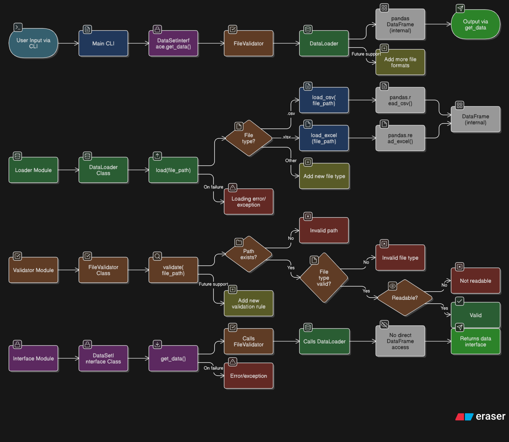

# 📊 Dataset Manager

<div align="center">


**A powerful, user-friendly CLI tool for validating and previewing CSV/Excel datasets with ease!**

[🚀 Quick Start](#-quick-start) • [💡 Features](#-features) • [📖 Documentation](#-documentation) • [🤝 Contributing](#-contributing)



</div>

---

## 🌟 Overview

**Dataset Manager** is a robust command-line interface (CLI) application designed to streamline the process of dataset validation and preview. Whether you're a data scientist, analyst, or developer, this tool provides a quick and reliable way to validate file integrity, check data formats, and preview your CSV and Excel files before diving into complex analysis.

### ✨ Why Dataset Manager?

- 🛡️ **Smart Validation**: Comprehensive file validation before loading
- ⚡ **Lightning Fast**: Quick preview of large datasets
- 🎯 **User-Friendly**: Intuitive CLI interface with clear feedback
- 📁 **Multi-Format**: Supports both CSV and Excel files
- 🔄 **Batch Processing**: Process multiple files in one session
- 🎨 **Clean Output**: Beautiful, formatted data previews

---

## 💡 Features

### 🔍 Core Functionality

| Feature | Description |
|---------|-------------|
| **File Validation** | Validates file existence, format, and accessibility |
| **Data Loading** | Efficient loading of CSV and Excel files |
| **Data Preview** | Quick preview of dataset structure and content |
| **Error Handling** | Comprehensive error messages and handling |
| **Interactive CLI** | User-friendly command-line interface |

### 🏗️ Architecture

- **Modular Design**: Clean separation of concerns with dedicated modules
- **Object-Oriented**: Well-structured classes for maintainability
- **Error Resilient**: Robust error handling throughout the application
- **Extensible**: Easy to add new file formats and features

---

## 🚀 Quick Start

### Prerequisites

- Python 3.8 or higher
- pip package manager

### Installation

1. **Clone the repository**
   ```bash
   git clone https://github.com/midrees555/Portfolio_Projects.git
   cd Dataset_Manager
   ```

2. **Install dependencies**
   ```bash
   pip install -r requirements.txt
   ```

3. **Run the application**
   ```bash
   python main.py
   ```

### 📱 Usage Example

```bash
$ python main.py

|============================================================|
|========== WELCOME  TO  DATASET_MANAGER  CLI  APP ==========|
Easily Validate & Preview Your .Csv Or .Xlsx Datasets

📂 Enter Dataset File Path (.csv or .xlsx): data/sample.csv

✅ Data Loaded Successfully!
📊 Preview (Top 5 Rows):
    Name   Age      City  Salary
0   John    25  New York   50000
1   Jane    30   Chicago   60000
2    Bob    35    Boston   70000
3  Alice    28    Miami    55000
4  Carol    32   Seattle   65000

🔁 Do you want to load another file? (Y/N): n
👋 Exiting... Thank You For Using Dataset_Manager
```

---

## 📖 Documentation

### 🗂️ Project Structure

```
Dataset_Manager/
├── 📄 main.py                    # Entry point for CLI application
├── 📄 requirements.txt           # Project dependencies
├── 📄 README.md                  # Project documentation
├── 📂 dataset_manager/           # Core application modules
│   ├── 📄 __init__.py
│   ├── 📄 data_loader.py         # Data loading functionality
│   ├── 📄 dataset_interface.py   # Public interface for data operations
│   └── 📄 file_validator.py      # File validation logic
├── 📂 tests/                     # Unit tests
│   ├── 📄 __init__.py
│   ├── 📄 test_interface.py
│   ├── 📄 test_loader.py
│   ├── 📄 test_validator.py
│   └── 📂 sample_data/           # Test data files
├── 📂 data/                      # Sample datasets
├── 📂 assets/                    # Documentation assets
└── 📂 utils/                     # Utility functions
    └── 📄 logger.py
```

### 🔧 Module Details

#### 📁 `FileValidator`
Handles comprehensive file validation:
- File existence verification
- Extension validation (.csv, .xlsx)
- File accessibility checks
- Readable permission validation

#### 📊 `DataLoader`
Manages data loading operations:
- Pandas-based CSV/Excel reading
- Empty dataset detection
- Error handling for corrupted files
- Memory-efficient loading

#### 🎯 `DataSetInterface`
Provides a clean public API:
- Unified interface for data operations
- Exception propagation for proper error handling
- Simple method calls for complex operations

### 🔄 Application Flow


1. **User Input**: File path entry through CLI
2. **Validation**: File existence, format, and accessibility checks
3. **Loading**: Data loading using pandas
4. **Preview**: Display first 5 rows of the dataset
5. **Continuation**: Option to process additional files

---

## 🧪 Testing

Run the comprehensive test suite:

```bash
# Run all tests
python -m pytest tests/

# Run specific test modules
python -m pytest tests/test_validator.py
python -m pytest tests/test_loader.py
python -m pytest tests/test_interface.py

# Run with coverage
python -m pytest tests/ --cov=dataset_manager
```

### Test Coverage
- ✅ File validation scenarios
- ✅ Data loading edge cases
- ✅ Error handling verification
- ✅ Interface functionality

---

## 🛠️ Development

### Adding New File Formats

1. Update `FileValidator` allowed extensions
2. Add loading logic in `DataLoader`
3. Create corresponding tests
4. Update documentation

### Example: Adding JSON Support

```python
# In file_validator.py
self.allowed_file_types = ['.csv', '.xlsx', '.json']

# In data_loader.py
elif file_path.endswith('.json'):
    df = pd.read_json(file_path)
```

---

## 🤝 Contributing

We welcome contributions! Here's how you can help:

1. **Fork** the repository
2. **Create** a feature branch (`git checkout -b feature/amazing-feature`)
3. **Commit** your changes (`git commit -m 'Add amazing feature'`)
4. **Push** to the branch (`git push origin feature/amazing-feature`)
5. **Open** a Pull Request

### 📋 Contribution Guidelines

- Follow PEP 8 style guidelines
- Add tests for new features
- Update documentation as needed
- Ensure all tests pass

---

## 📊 Performance

- **Memory Efficient**: Optimized pandas operations
- **Fast Loading**: Efficient file I/O operations
- **Scalable**: Handles large datasets gracefully
- **Resource Friendly**: Minimal system resource usage

---

## 🔗 Links & Resources

### 🌐 Connect with the Developer

| Platform | Link |
|----------|------|
| 🐙 **GitHub Portfolio** | [github.com/midrees555/Portfolio_Projects](https://github.com/midrees555/Portfolio_Projects) |
| 💼 **LinkedIn** | [linkedin.com/in/your-profile](https://linkedin.com/in/your-profile) |
| 📧 **Email** | [your.email@example.com](mailto:your.email@example.com) |
| 🌍 **Portfolio Website** | [your-portfolio.com](https://your-portfolio.com) |

### 📂 Related Projects

- 🔍 **[Data Analysis Toolkit](https://github.com/midrees555/Portfolio_Projects/tree/main/Data_Analysis_Toolkit)** - Advanced data analysis utilities
- 📈 **[ML Pipeline Manager](https://github.com/midrees555/Portfolio_Projects/tree/main/ML_Pipeline)** - Machine learning workflow automation
- 🎯 **[API Data Fetcher](https://github.com/midrees555/Portfolio_Projects/tree/main/API_Fetcher)** - REST API data collection tool

### 🔧 Dependencies

- **[Pandas](https://pandas.pydata.org/)** - Data manipulation and analysis
- **[OpenPyXL](https://openpyxl.readthedocs.io/)** - Excel file handling
- **[Pytest](https://pytest.org/)** - Testing framework

---

## 📄 License

This project is licensed under the MIT License - see the [LICENSE](LICENSE) file for details.

---

## 🙏 Acknowledgments

- Thanks to the **Pandas** team for the amazing data manipulation library
- **OpenPyXL** contributors for Excel file support
- **Python** community for continuous inspiration

---

<div align="center">

**⭐ If you found this project helpful, please give it a star!**

**Made with ❤️ by [Midrees](https://github.com/midrees555)**

[🔝 Back to Top](#-dataset-manager)

</div>