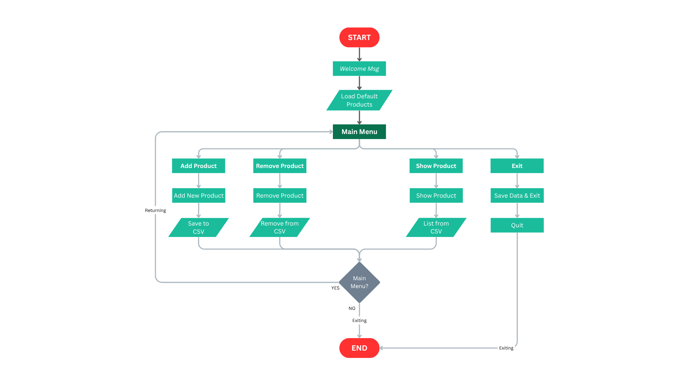
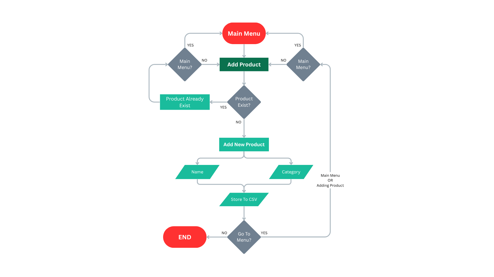
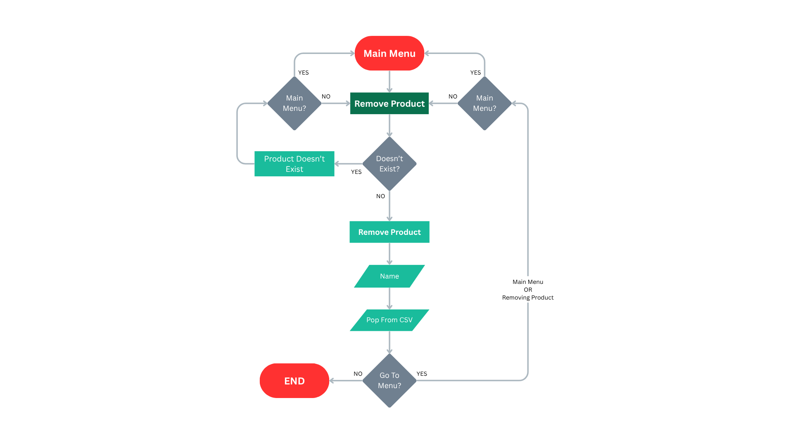
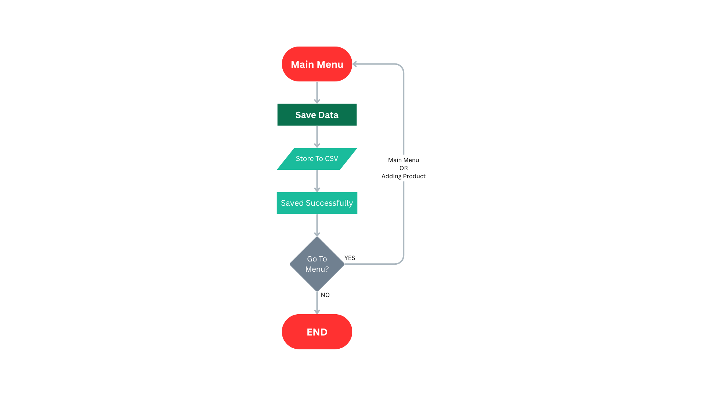

# 🧾 Inventory CLI Manager (Python)

**Inventory CLI Manager** is a beginner-friendly, command-line application that allows users to manage a product inventory efficiently. It helps add, remove, and view products with persistent file storage using **JSON**. Designed to simulate a freelance-style business task, this project reflects best practices in clean coding, modular design, and user input validation.

---

## 🚀 Project Highlights

- 📦 Add & remove products dynamically
- 💾 Persistent storage with JSON (`products.json`)
- 🛡️ Input validation to ensure data quality
- 🧠 Modular structure for maintainability
- 💻 Command-line interface (CLI) for interaction
- 🗃️ Auto-save/load inventory from file
- 📁 Handles file creation and edge cases gracefully

---

## 🛠️ Technologies Used

- **Python 3**
- Standard Libraries:
  - `os` — directory handling
  - `json` — file storage
- CLI-based I/O (no external dependencies)

---

## 🧩 Project Structure

```bash
Inventory_CLI_Manager/
│
├── data/                  # Stores inventory data as JSON
│   └── products.json
│
├── assets/                # (Optional) Flowcharts or images/future updates
│   └── flow_chart_images/
│
├── main.py                # Entry point, handles user interactions
├── inventory.py           # Core logic: add, remove, list products
├── file_handler.py        # JSON file I/O for persistence
├── utils.py               # Validation and utility helpers
├── constants.py           # Static CLI menu and messages
└── README.md              # You're reading it right now
```

---

## 📋 Features Overview

| Feature           | Description                                                             |
| ----------------- | ----------------------------------------------------------------------- |
| Add Product       | Accepts a product name and price, validates, and stores it persistently |
| Remove Product    | Deletes a product by name (case-insensitive) with fallback add option   |
| Show All Products | Displays a tabular view of all current inventory                        |
| Exit              | Gracefully exits the program                                            |

---

## 🧪 Sample Run (CLI)

```bash
1. Add Product
2. Remove Product
3. Show All Products
4. Exit

Select an option: 1
Enter a product name: Mouse
Enter a product price: 899

✔️  Product 'mouse' added successfully!
✔️  Products list updated successfully!
```

---

## � Visual Demonstration

Here's a visual walkthrough of the Inventory CLI Manager in action:

### Main Menu Interface


### Adding a Product


### Removing a Product


### Save & Exit Functionality


---

## �💡 Learning Objectives

This project is part of my journey to:

- Improve core Python skills through hands-on CLI app development
- Learn real-world file handling (read/write JSON)
- Practice modular code organization and documentation
- Simulate a small freelance project scenario
- Enhance GitHub & portfolio visibility

---

## 📈 Future Enhancements (Planned)

 - Add product quantity field
 - Search and update product
 - CLI color themes for improved UX
 - Add report generation with stats (CSV or tabular view)

---

## 🧑‍💻 Author

**MUHAMMAD IDREES**<br>
  *Aspiring Data Scientist | Python Developer | Tech Learner*<br>
  [GitHub](https://github.com/midrees555/Portfolio_Projects/) |
  [LinkedIn](https://www.linkedin.com/in/midrees555/) | 
  [Email](mailto:info.midrees@gmail.com)<br>
  [Explore More](https://github.com/midrees555/)

  ---

  ## 📜 License

  This project is open-source and free to use for learning and educational purposes.

  ---