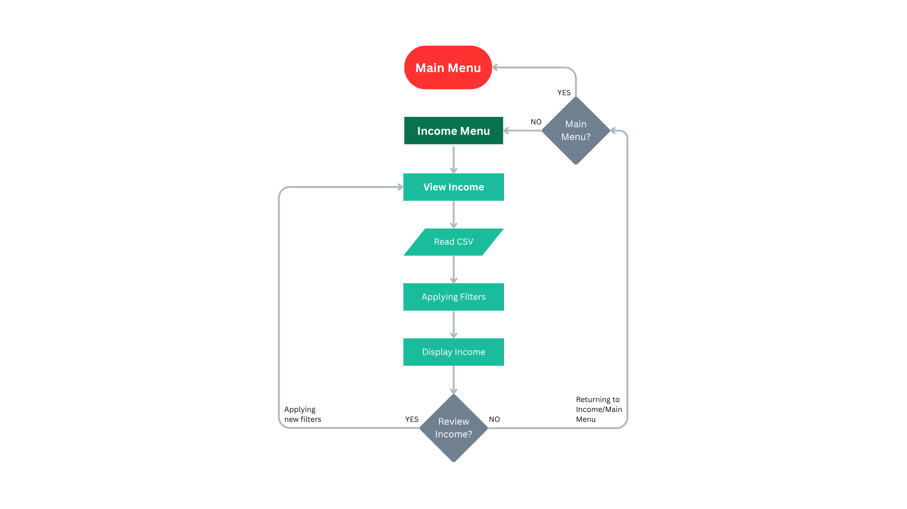

# 💰 SMART_EXPENSE_TRACKER - A CLI Based Personal Finance Tracker in Python

> _"Track your money smartly, Stay financeially healthy!"_

---

## 📌 Project Overview

**SMART_EXPENSE_TRACKER** is a beginner-to-intermediate level **Command-Line interface (CLI)** Python application designed to help users **track their income and expenses**, **manage categories**, and **insightful reports** - all through a clean, modular structure.<br>
This project started from scratch and was built step-by-step with a strong focus on **learning core python concepts** and **writing clean, professional code**.

---

## Application Flow





# insert PDF in markdown language


---

## 🎯 Why This Project?

Managing personal finance is crucial in everyday life, especially for students, freelancers, and early professionals. Yet, most people don't track where their money goes.

**This CLI tools provides:**
- A simple yet structured way to record daily transactions
- Category-wise insights into your earnings and spendings
- Persistant balance saving - even after restarting program
- A chance for the developer (Me!) to apply and learn real python skills by solving a real-life problem

---

## ✔️ Key Features

- 📥 **Add income & Expenses**
- 📂 **Select or Save Custom Categories** (Case-insensitive and Duplicate-proof)
- 🧠 **Input Validation** and User Error Handling
- 💾 **Persistant Balance Storage** (Data stays across sessions)
- 📊 **View & Generate Filtered Reports** (by Date, Category, or Range)
- 📁 **CSV Exports of Reports**
- 🧹 **Clean Modular Codebase**

---

## 🧑‍💻 Technologies & Concepts Used

| Area                  | Concepts / Technologies                            |
|-----------------------|----------------------------------------------------|
| **Language**          | Python (Core + Standard Library)                   |
| **Programming Style** | Modular Programming, Clean Code Structure          |
| **Core Concepts**     | Variables, Functions, Loops, Conditionals          |
| **File Handling**     | Read/Write to `.txt` & `.csv` files                |
| **Validation**        | Type Checking, Error Catching, Retry Logic         |
| **Persistence**       | Saving categories and balance across runs          |
| **CLI Design**        | Clear prompts, menu-style inputs, user-friendly UX|

---

## 🗂️ Project Folder Structure

SMART_EXPENSE_TRACKER/<br>
│<br>
├── data/ # Contains persistent data files<br>
│ ├── income.csv # income saved<br>
│ ├── expense.csv # expense saved<br>
│ ├── balance.txt<br>
│ ├── income_categories.txt<br>
│ └── expense_categories.txt<br>
│<br>
├── expenses/ # All about expenses<br>
│ ├── add.py<br>
│ ├── report.py<br>
│ ├── view.py<br>
|<br>
├── income/ # All about income<br>
│ ├── add.py<br>
│ ├── report.py<br>
│ ├── view.py<br>
|<br>
├── utils/ # (Optional) Custom input handlers/utilities<br>
│ ├── clear_data.py<br>
│ ├── file_handler.py # Read/write helpers for files<br>
│ ├── validation.py # Input validation and error checking<br>
|<br>
├── balance_handler.py # Handles all about balances - add/subtract<br>
├── constants.py # Stores default categories & file paths<br>
├── main.py # Main entry point of the application<br>
│<br>
└── README.md # You’re reading it!<br>

---

## 🚀 How To Run The Project

> 📝 **Requirements**: Python 3.x should be installed on your system

### 1. Clone the Repository

```bash
git clone https://github.com/midrees555/python-small-projects.git
cd python python-small-projects/SMART_EXPENSE_TRACKER
```

### 2. Run the Application

```bash
python main.py
```

### 3. Interact via the Menu

Follow the on-screen instructions too:
- Add starting balance initially
- A an income or expense
- Select or create category with date
- View/ Generate reports
- View your current balance 

---

## 📺 Sample CLI Screenshot

====== SMART EXPENSE TRACKER ======

Choose an action:
1. Add Expenses
2. Add Income
3. View / Generate Report     
4. View Balance & Exit        
5. Reset Categories to Default
6. Clear All Data & Reset App

Enter a choice (1-4): 1

Enter Expense Amount: 10500

Choose Expense Category:
1. Education
2. Entertainment        
3. Food
4. Health
5. Shopping
6. Transport
7. Add new Expense Category

Enter you choice: 2

Enter Expense Date (YYYY-MM-DD) or Press enter for Today:  [2025-07-06]:

✔️  Data Saved Successfully!

---

## 🙌 Special Thanks & Reflections

> **Alhamdulillah** — I'm truly thankful to **Allah Ta’ala** and my **parents** for their endless support. This project reflects my personal growth in programming and self-discipline

From learning core Python syntax to implementing real-world logic — every step taught me something valuable.

---

## 💡 Final Words

If you're starting your Python journey or want to build real-life CLI projects with clean modular code, this is a great place to get inspired. I hope this project encourages others to take control of both their **learning** and their **spending**.

---

## 📬 Feedback & Collaboration

Feel free to:

- ⭐ Star the repo
- 🛠 Suggest improvements
  
**Get in Touch via**:

- LinkedIn: [LinkedIn](https://www.linkedin.com/in/midrees555/)
- Email: [Email](mailto:info.midrees@gmail.com)
- [Explore More](https://github.com/midrees555/)

---

### _Special Quoats for this Project_

> _❝ Small steps, consistent effort, and a sincere intention can lead to impactful results ❞._

---

### 🤲 _Special Apeal_
> **_Don't Forget Me On Your Daily Prayers_**

---